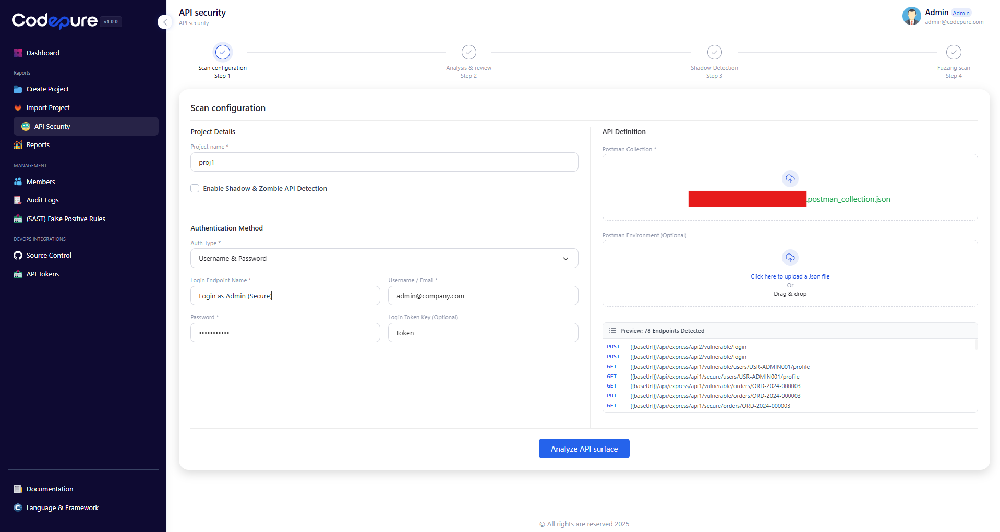
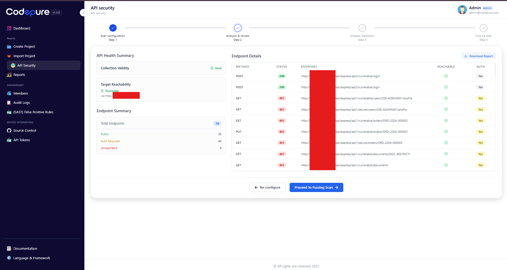
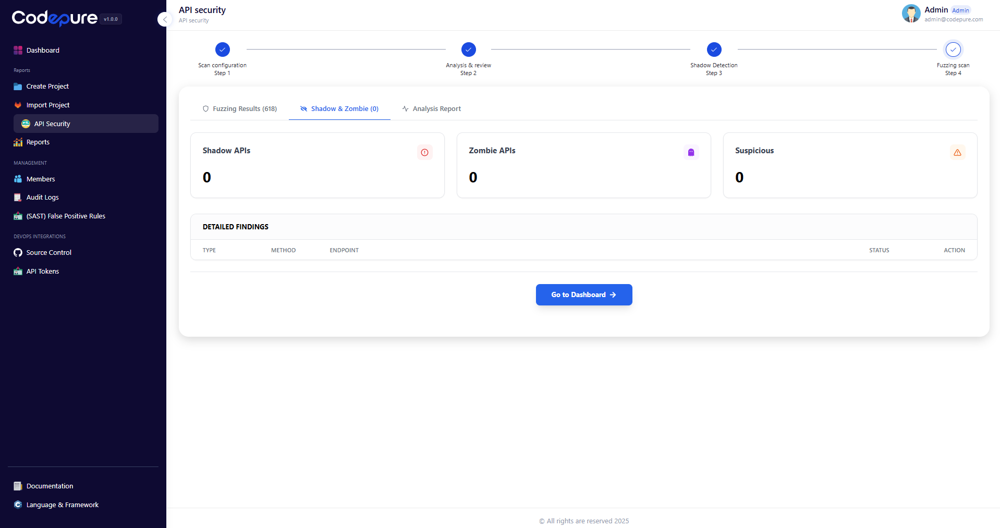
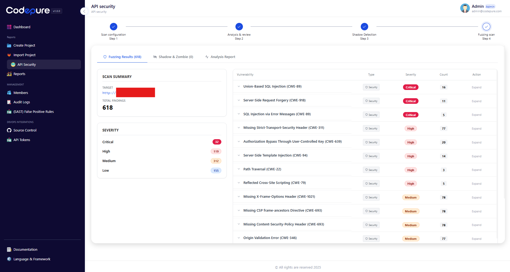
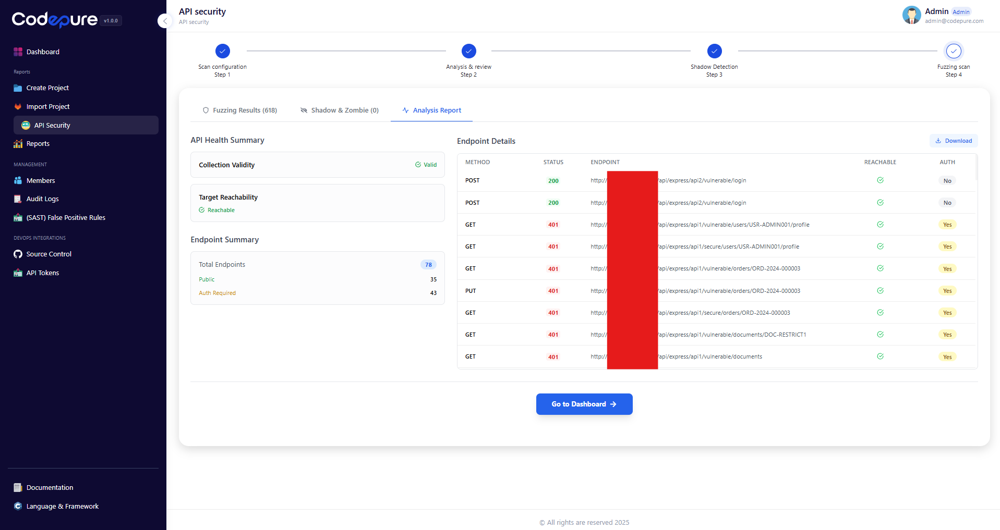

# API Security Scanner

## Overview

The Codepure API Security Scanner is designed to actively identify security weaknesses in your live applications. Instead of just reading code, our scanner connects directly to your running API endpoints, performing deep fuzzing and logic testing to simulate real-world attack scenarios.

This approach allows you to uncover critical runtime vulnerabilities—such as authorization bypasses, injection flaws, and data exposure risks—that typically go undetected by standard static analysis (SAST) tools.

---

## Workflow Guide

The API Security scanning process consists of four logical steps: **Scan Configuration**, **Analysis & Review**, **Shadow Detection**, and **Fuzzing Scan**.

### Step 1: Scan Configuration

To begin a scan, you must define the target API surface and authentication parameters. This ensures the scanner understands how to interact with your application correctly.

**1. Project Details:**
* **Project Name:** Assign a unique name to your scan project.
* **Shadow & Zombie Detection:** Toggle this option to enable discovery of undocumented or deprecated endpoints.

**2. Authentication Method:**
The scanner requires access to authenticated endpoints to perform deep security testing.
* **Auth Type:** Select your method (e.g., *Username & Password*, *API Key*, or *Bearer Token*).
* **Login Endpoint:** Define the specific endpoint used for authentication (e.g., `/api/login`).
* **Credentials:** Provide a valid test user account.
* **Login Token Key:** Specify the JSON key where the token is returned (e.g., `token` or `access_token`), allowing the scanner to maintain a session automatically.

**3. API Definition:**
Upload your API definition to map the attack surface.
* **Postman Collection:** Upload a standard `.json` Postman Collection export.
* **Postman Environment (Optional):** If your collection uses variables, upload the corresponding environment file.

Once configured, click **Analyze API surface** to proceed.

*Figure 1: Setting up project details, authentication, and uploading the API definition.*

---

### Step 2: Analysis & Health Check

Before launching a full attack simulation, Codepure performs a "Health Check" on your API. This step verifies that the scanner can successfully reach the endpoints and authenticate using the credentials provided in Step 1.

**Key Indicators:**
* **Collection Validity:** Confirms the uploaded Postman file is parsed correctly.
* **Target Reachability:** Ensures the host server is responding.
* **Endpoint Summary:** A breakdown of Public vs. Auth-Required endpoints.

**Endpoint Details Table:**
Review the list of detected endpoints. Ensure that the **Status** is valid (e.g., 200 OK or expected 401s) and that the **Reachable** checkmark is green. If the health check fails, you can click "Re-configure" to adjust your settings.

If the surface looks correct, click **Proceed to Fuzzing Scan**.

*Figure 2: Reviewing endpoint reachability and authentication status before scanning.*

---

### Step 3: Shadow & Zombie API Detection

*Note: This step runs automatically if enabled during configuration.*

Modern applications often suffer from API sprawl. Codepure helps you identify endpoints that exist but are not properly managed.

* **Shadow APIs:** Endpoints that are active on the server but were not included in your provided documentation (Postman collection). These represent a significant risk as they are often unpatched.
* **Zombie APIs:** Deprecated endpoints that were supposed to be removed but are still accessible.

*Figure 3: The Shadow & Zombie dashboard highlights undocumented or deprecated API routes.*

---

### Step 4: Fuzzing Scan & Results

This is the core of the API Security module. The scanner performs aggressive fuzzing, sending malformed data and logic tests to every endpoint to trigger security exceptions.

**Dashboard Overview:**
* **Scan Summary:** Displays the total number of findings.
* **Severity Breakdown:** Vulnerabilities are categorized by impact (**Critical**, **High**, **Medium**, **Low**).

**Vulnerability List:**
The detailed list highlights specific CVEs and CWEs found in your API, such as:
* **SQL Injection (CWE-89):** Attempts to manipulate database queries.
* **SSRF (CWE-918):** Server-Side Request Forgery attempts.
* **Authorization Bypass (CWE-639):** Tests if users can access data belonging to others.
* **Security Header Misconfigurations:** Checks for HSTS, CSP, and Frame-Options.

You can click **"Expand"** on any finding to see the request/response payload evidence and remediation advice.

*Figure 4: The Fuzzing Results dashboard showing a list of critical and high-severity vulnerabilities.*

---

## Reporting

Once the scan is complete, you can generate a compliance report.

1.  Navigate to the **Analysis Report** tab.
2.  Click **Download Report** to export a PDF summary for your compliance team or developers.

*Figure 5: Accessing the detailed analysis report and export options.*